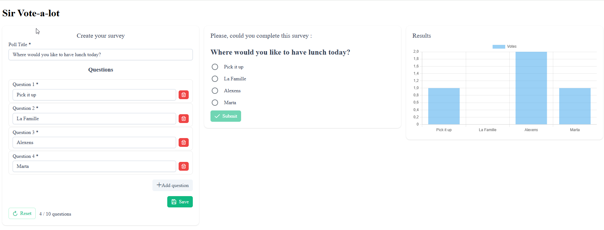
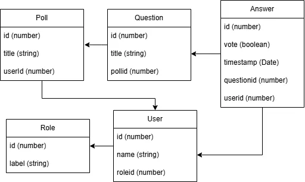

- [1. PollAssignment](#1-pollassignment)
  - [1.1. Roadmap / Backlog](#11-roadmap--backlog)
    - [1.1.1. Priorities by components](#111-priorities-by-components)
    - [1.1.2. Unit Tests](#112-unit-tests)
  - [1.2. UI/UX](#12-uiux)
    - [1.2.1. Actual main screen](#121-actual-main-screen)
    - [1.2.2. Theme](#122-theme)
    - [1.2.3. Admin's form](#123-admins-form)
    - [1.2.4. Poll](#124-poll)
    - [1.2.5. Results' view](#125-results-view)
- [2. 🛠️ Stack](#2-️-stack)
- [3. 🛢️ Database](#3-️-database)
  - [3.1. 🗺️ Schema](#31-️-schema)
  - [3.2. 🗃️ Entities](#32-️-entities)
    - [3.2.1. 🎭 Role](#321--role)
    - [3.2.2. 👤 User](#322--user)
    - [3.2.3. 📝 Poll](#323--poll)
    - [3.2.4. ❓ Question](#324--question)
    - [3.2.5. 💬 Answer](#325--answer)
  - [3.3. 🌱 Seed Initialization](#33--seed-initialization)
    - [3.3.1. Seeds' values](#331-seeds-values)
      - [3.3.1.1. Roles](#3311-roles)
      - [3.3.1.2. Users](#3312-users)
    - [3.3.2. How It Works](#332-how-it-works)
    - [3.3.3. Implementation Details](#333-implementation-details)
- [4. Developper](#4-developper)
  - [4.1. Development server](#41-development-server)
  - [4.2. Building](#42-building)
  - [4.3. Running unit tests](#43-running-unit-tests)
  - [4.4. Running end-to-end tests](#44-running-end-to-end-tests)
  - [4.5. Additional Resources](#45-additional-resources)


# 1. PollAssignment

***Design your poll and let users answer it.***

PollAssignment is a local‑first single-page polling application written in Typescript.

## 1.1. Roadmap / Backlog

### 1.1.1. Priorities by components
- User-management
  - Feature : Authentification system
    - Add "password" field in
      - mydb.ts IndexedDB
      - user's model
    - Add Seeds to create "SuperUser" and "Manager" users
- Survey-Admin
  - UI/UX : Block access to user != admin
  - Feature : Remove save button in favor of autosave
- Poll-page
  - UX : Authentification topleft icon menu (a field to log and display the user and its role)
  - UI : Highlight with border the focused panel and Shadow others
- Survey-Probe
  - Feature : Other type of poll : currently only radio button
    - DB : add field comment in answer question
      - .html : to manage different types of answer
      - .ts : to manage different types of answer
    - DN : update "vote:boolean" to be an array of boolean and then detecs how many are required from survey-poll = pollContextService
- User-management
  - UX : Add admin's page to display and manage users
    - Feature : Add CRUD methods
- Answer management
  - To manage texts : Add "comment: string" field
    - mydb.ts IndexedDB 
    - answer's model
- Optimise every Classes to reach SOLID

### 1.1.2. Unit Tests
- Code all the units tests.

## 1.2. UI/UX

### 1.2.1. Actual main screen

Here a screenshot of PollAssigment in a browser setted with a light theme.
It is divided in three panels, from left to right : 
- Admin's tab : "Create your survey"
- Users' tab : "Please, could you complete this survey ?"
- Chart's tab : "Results"



### 1.2.2. Theme
PrimeNG detects if your browser is in dark mod.

### 1.2.3. Admin's form
A minimum of 2 questions is mandatory and a maximum of 10 is setted.
All fields (title and questions) are limited to 80 characters.

Warning : When the refresh button is pressed, all the related information to your survey are erased ! In this order : first, the results, then, the displayed questions, then the poll itself. It is related to how the database's schema is.

Thanks to PollContextService, when a poll is created, it is shared through a signal.

### 1.2.4. Poll
Currently, user can only submit a single answer with a radio button (true/false)

### 1.2.5. Results' view

# 2. 🛠️ Stack

- Angular v^19.2.0 : https://v19.angular.dev/overview
- PrimeNG v^19.1.4 : https://www.npmjs.com/package/primeng and https://v19.primeng.org/
- idb v^8.0.3 : https://www.npmjs.com/package/idb

# 3. 🛢️ Database

## 3.1. 🗺️ Schema

Database is stored in IndexedDB thanks to **idb wrapper**. Here its schema:



## 3.2. 🗃️ Entities

There are 5 entities :

### 3.2.1. 🎭 Role
- 🗝️ id: number;
- label: string;

### 3.2.2. 👤 User
- 🗝️ id: number;
- name: string;
- 🗝️👽 roleid: number;

### 3.2.3. 📝 Poll
- 🗝️ id: number;
- title: string;
- 🗝️👽 userid: number;

### 3.2.4. ❓ Question
- 🗝️ id: number;
- title: string;
- 🗝️👽 pollid: number;

### 3.2.5. 💬 Answer
- 🗝️ id: number; 
- vote: boolean; 
- timestamp: Date; 
- 🗝️👽 questionid: number; 
- 🗝️👽 userid: number;

## 3.3. 🌱 Seed Initialization

When the application starts, a **seed service** automatically initializes the database with default roles if they don't already exist. This ensures the database is always in a valid state for the application to operate.

### 3.3.1. Seeds' values

#### 3.3.1.1. Roles
There are two roles seeded at runtime.
{label: 'Admin', id: 1}
{label: 'User', id: 2}

#### 3.3.1.2. Users
Are expected but not implemented yet:
{name: 'Editor', password:admin, roleId: 1, id: 1} : involves to add password in models and db.
{name: 'Respondent', roleId: 2, id: 2}

### 3.3.2. How It Works

1. **Idempotent Initialization**: The seed runs only once per unique role. If a role with the same label already exists in the database, it is skipped.

2. **Default Roles**: Two default roles are automatically created on first run:
   - **Admin**: Administrator role with full permissions
   - **User**: Standard user role with limited permissions

3. **Startup Integration**: The seed is executed during Angular application bootstrap via `provideAppInitializer()`. This ensures all required data exists before any component interacts with the database.

4. **Error Handling**: If role creation fails, the error is logged but does not prevent the application from starting. Users can manually reseed the database if needed.

### 3.3.3. Implementation Details

- **Service**: [`src/app/db/seed/seed.service.ts`](src/app/db/seed/seed.service.ts)
- **Seed Data**: [`src/app/db/seed/default-roles.seed.ts`](src/app/db/seed/default-roles.seed.ts)
- **Configuration**: Integrated in [`src/app/app.config.ts`](src/app/app.config.ts)
- **Tests**: Comprehensive unit tests in [`src/app/db/seed/seed.service.spec.ts`](src/app/db/seed/seed.service.spec.ts)

# 4. Developper

## 4.1. Development server

To start a local development server of PollAssigmnent, run:

```bash
ng serve
```

Once the server is running, open your browser and navigate to :
- `http://localhost:4200/`

The application will automatically reload whenever you modify any of the source files.

## 4.2. Building

To build the project run:

```bash
ng build
```

This will compile your project and store the build artifacts in the `dist/` directory. By default, the production build optimizes your application for performance and speed.

## 4.3. Running unit tests

To execute unit tests with the [Karma](https://karma-runner.github.io) test runner, use the following command:

```bash
ng test
```

## 4.4. Running end-to-end tests

For end-to-end (e2e) testing, run:

```bash
ng e2e
```

Angular CLI does not come with an end-to-end testing framework by default. You can choose one that suits your needs.

## 4.5. Additional Resources

For more information on using the Angular CLI, including detailed command references, visit the [Angular CLI Overview and Command Reference](https://angular.dev/tools/cli) page.
